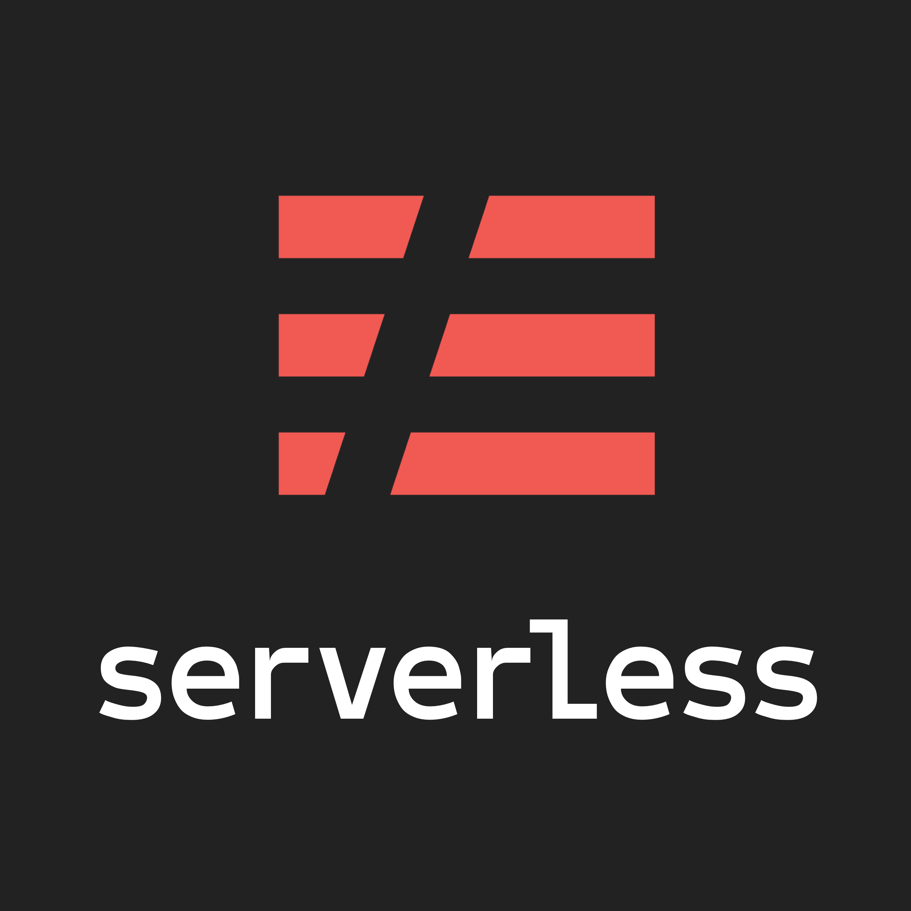

<h1 align="center">
    
    <p>Serverless Api Poc</p>
</h1>

<h4 align="center"> 
	Este repositório consiste de uma API feita em Node.js que usa serverless framework, AWS API Gateway, Lambdas e DynamoDB.
</h4>

<div align="center">

[]()
[]()
[]()
[]()
[](/LICENSE)

</div>

## 📝 Conteúdo
<p align="center">
<a href="#fabricio">Sobre</a>&nbsp;&nbsp;&nbsp;|&nbsp;&nbsp;&nbsp;
<a href="#getting_started">Iniciando</a>&nbsp;&nbsp;&nbsp;|&nbsp;&nbsp;&nbsp;
<a href="#installing">Instalando</a>&nbsp;&nbsp;&nbsp;|&nbsp;&nbsp;&nbsp;
<a href="#built_using">Tecnologias Utilizadas</a>&nbsp;&nbsp;&nbsp;|&nbsp;&nbsp;&nbsp;
<a href="#authors">Autor</a>
</p>

### ⚒ Instalando <a name = "installing"></a>
```bash
# Clone this repository
$ git clone https://github.com/fcsouza/serverless-api-poc

# Go into the repository
$ cd serverless-api-poc/

```

## ⛏️ Tecnologias Utilizadas <a name = "built_using"></a>
- [Serverless](https://www.serverless.com/) - Serverless Framework
- [AWS SDK](https://www.npmjs.com/package/aws-sdk) - AWS SDK

## ✍️ Autor <a name = "authors"></a>

- [@fcsouza](https://github.com/fcsouza)

## 🗒 Licença

Esse projeto está sob a licença MIT. Veja o arquivo [LICENSE](LICENSE.md) para mais detalhes.
